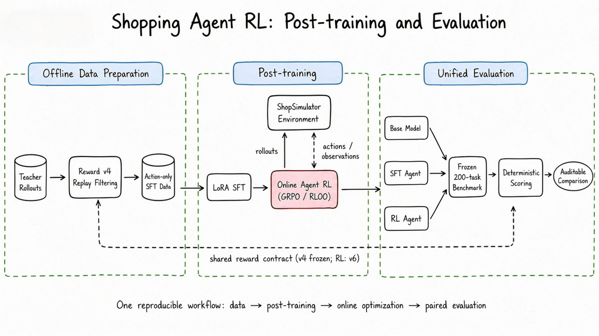
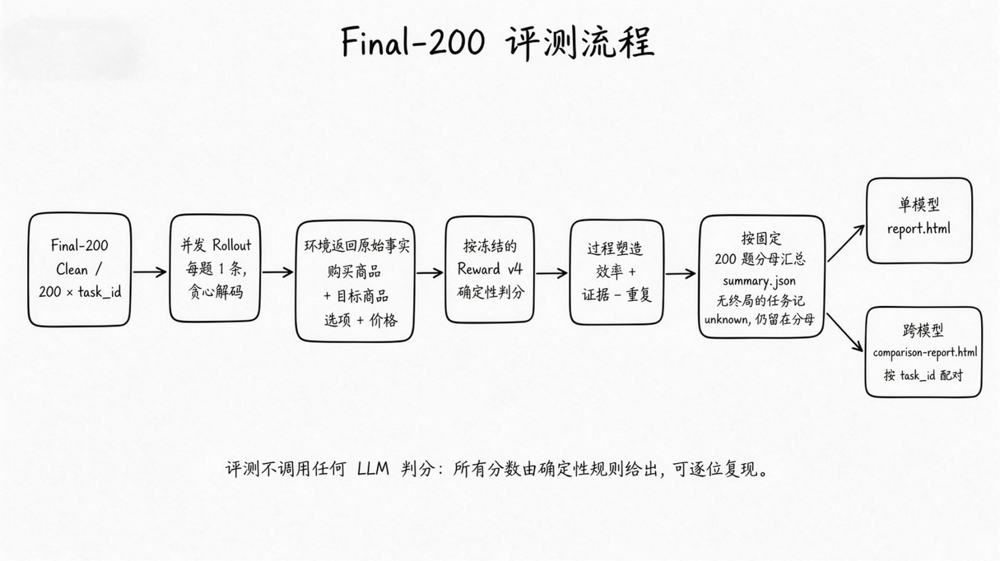
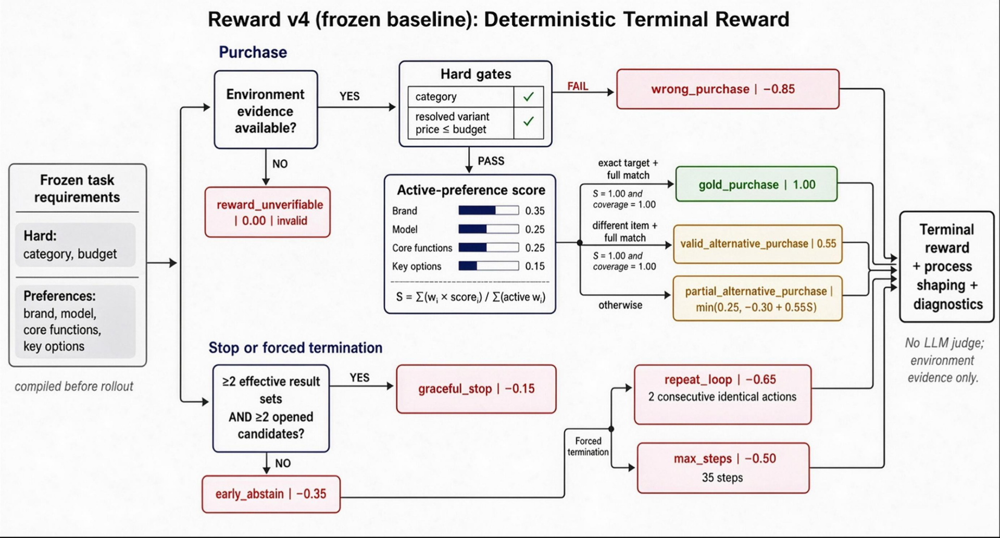

# Shopping Agent RL

<div align="center">

面向长程购物 Agent 的可复现后训练与评测项目

<br />

[](pyproject.toml)
[](https://huggingface.co/openbmb/MiniCPM5-2B)
[](#实验结果)
[](https://arxiv.org/pdf/2601.18225)
[](data/evaluation/tasks.jsonl)

<br />


</div>

## ShopSimulator 是什么？

[ShopSimulator](https://arxiv.org/pdf/2601.18225) 是一个用于评估长程购物
Agent 的大规模中文购物环境。每个任务会给出一段用户需求，其中可能包含商品类别、
预算、品牌、型号、核心功能以及颜色、尺寸、容量、套餐等具体规格。

Agent 不能只生成一句“推荐购买某商品”，而是必须真正与环境交互：

1. 根据需求搜索商品；
2. 打开并比较候选商品；
3. 查看描述、参数和可选规格；
4. 选择正确的商品变体；
5. 购买满足约束的商品，或者在证据充分时合理终止。

这类任务同时考察指令理解、工具调用、长上下文管理、约束满足和终止决策。项目内嵌
了冻结的 ShopSimulator Environment v2.1 源码和商品数据，位于
[`environments/ShopSimulator/`](environments/ShopSimulator/)，不需要用户再单独
克隆或修改一份环境仓库。环境是一个**纯模拟器**：只返回原始事实（购买结果、目标
商品、候选选项、价格、终止原因），不做任何打分。


> 图源：ShopSimulator 论文 Figure 1（[arXiv:2601.18225](https://arxiv.org/pdf/2601.18225)）。

## 项目做了什么？


项目按照一条连续的后训练流水线组织，**每个环节只有一个入口**：
> 数据准备：教师 API 采集 → 锁冻结 Reward v4 重打分 → 仅 assistant token 算 loss 的 SFT 数据；
> 后训练：三阶段课程 LoRA SFT（a/b/c）→ 在线 RL（GRPO / RLOO）与环境交互采样；
> 统一评测：Base / SFT / RL 模型 → 冻结的 Final-200 Clean → 确定性判分 → 可审计对比。
> 底部虚线表示全流程共用同一个奖励契约：**采集 / 筛选 / SFT / 测评固定 v4，RL 使用选中版本（当前 v6）**。
> 评测不做任何 LLM 判分——每道题按确定性规则打分、按固定 200 题分母聚合，分数可逐位复现。

| 环节 | 目标 | 入口 |
|---|---|---|
| 前置 | 安装/启停 ShopSimulator（其余环节的前置条件） | `python scripts/00_environment.py setup\|start\|status\|smoke\|stop` |
| 采集 | 教师模型（OpenAI 兼容 API）在真实环境里生成轨迹，可增量补采 | `python scripts/01_collect.py` |
| 筛选 | 重打分（锁冻结的 Reward v4）→ 过滤 → 难度标签 → 课程清单 → RL 任务集 | `python scripts/02_filter.py` |
| SFT | 课程 a/b/c 逐级 LoRA，归档为 `models/sft` | `python scripts/03_sft.py` |
| RL | 在线 GRPO 或 RLOO，导出为 `models/rl/<label>`（`--label` 命名） | `python scripts/04_rl.py grpo` / `python scripts/04_rl.py rloo` |
| 测评 | 同一批 Final-200 Clean 盲测任务上公平比较 | `python scripts/05_evaluate.py <模型目录>` |

所有参数只写在 [`configs/`](configs/) 里：`pipeline.yaml` 保存全局设置（模型、
目录、端口、奖励参数），每个环节一个 `configs/<环节>.yaml`。

### 采集与筛选是怎么做的？

**本仓库没有从头采集**：SFT 数据（1,192 条）与 Final-200 Clean 盲测集（200 题）直接沿用上游项目
[YYHDBL/shopping-grpo-longhorizon](https://github.com/YYHDBL/shopping-grpo-longhorizon) 的教师采集产物。所以复现本文的结果**不需要**跑 `01_collect` 与 `02_filter`，从「SFT」开始即可。

这两个环节仍完整保留，换教师模型或换环境时可以重跑：

- **采集（`01_collect`）**：教师模型走 OpenAI 兼容 API，在真实 ShopSimulator 里逐步执行动作；只有
  形成完整的 `gold_purchase` 终局且 `reward_valid=true` 的轨迹才被接受。任务池按固定 seed 抽样、
  **永远排除盲测 200 题**，重跑只补差额、已采的自动跳过；
- **筛选（`02_filter`）**：用冻结的 Reward v4 过程分（效率 + 证据 − 重复）重排序、每题保留最优轨迹，
  再补难度标签，生成 a/b/c 课程清单与 RL 任务集（与 SFT、盲测任务**两两不相交**）。

产物：`data/sft/{all.jsonl,curriculum.json,difficulty_labels.jsonl}`、
`data/rl/{train,validation}.parquet`；采集明细在 `works/collect/`。

#### 如果要换教师重新采集

教师走任意 OpenAI 兼容端点（`OPENAI_BASE_URL` / `OPENAI_API_KEY` / `OPENAI_MODEL`，默认
`deepseek-flash`）。规模由 `configs/collect.yaml` 决定，必须满足
`target_tasks × attempts-per-task × 经验验收率 ≳ target-accepted`：经验验收率约 **0.4**，默认
`2400 × 1 × 0.4 ≈ 960 ≥ 900`，不满足时入口直接告警。先小规模试一步：
`01_collect.py --target-tasks 8 --target-accepted 2`；已有轨迹时 `--build-only` 只重建统计。

> 教师若是 DeepSeek 托管模型，客户端会显式下发 `thinking: {"type": "disabled"}`——省略该字段
> **不等于**关闭，否则正文留空、不发 tool call，轨迹会被判为 `assistant_final` 而拒绝。

### RL 是怎么训练的？

RL 从合并后的 SFT 模型开始，支持两种算法（同一套数据、同一个环境）：

- **GRPO**（`configs/grpo.yaml`）：veRL 为每个 Prompt 在线生成 8 条轨迹，用同一
  奖励做组内相对优势；开启 bounded 动态采样，丢弃组内奖励完全相同的无信号组并
  重新采样（最多 3 批），训练信号更集中；
- **RLOO**（`configs/rloo.yaml`）：留一法基线，同组大小 8、不需要组内标准差，动态采样关闭。

训练不使用额外的 LLM-as-a-Judge Reward Model。本仓库没有复制 veRL 源码，而是固定
安装 `verl==0.8.0`，并保留项目自己的 AgentLoop、工具适配层、运行时兼容代码和一个
小补丁（`patches/`，由 RL 入口自动应用）。详细配置见 `configs/grpo.yaml` 与
`configs/rloo.yaml`。

### 评估流水线是怎么设计的？

评估**不调用任何语言模型打分**。每道题由代码在真实 ShopSimulator 里跑一次 Rollout，再用冻结的
Reward v4 确定性规则判分（与 RL 选用的 reward 版本解耦），最后按固定分母聚合——同一批任务上的
分数可以逐位复现。



> 判分按冻结的 Reward v4 终局规则给出：`gold_purchase` / `valid_alternative_purchase` /
> `partial_alternative_purchase` / `wrong_purchase` / `repeat_loop` / `max_steps` / `early_abstain` /
> `graceful_stop` / `reward_unverifiable`；过程塑造为「效率 + 证据 − 重复」，探索项默认关闭。
> 无终局（报错 / 未完成）的任务记为 `unknown`，仍留在 200 题分母里。

主指标是**严格成功率**（`gold_purchase` + `reward_valid=true` + 真实购买成功）；
平均 Reward 属于过程参考指标。缺失、报错和没有终局的任务仍留在 200 题分母里，不会被剔除。

评测默认 **8 个任务并发**（`configs/eval.yaml` 的 `workers`，1 即串行），每题只跑 **1 条**且用
**贪心解码**（`temperature=0`、`top_p=1.0`）——所以它是**一次确定性判定**，而不是采样估计：
这也意味着这张表**不反映采样方差**，8 个模型是在同一把确定性的尺子下比较。

报告只展示分栏结果，不合成一个综合总分：

1. 严格成功率、购买成功率、Reward 有效率和终局类型分布；
2. 过程塑造分项（效率 / 证据 / 探索 / 重复）与平均步数；
3. 步数区间、工具调用分布、Guard 拒绝、Observation 截断与上下文指标；
4. 协议与数据完整性（benchmark 路径、采样参数、缺失任务）。

Rollout 采样参数在 `configs/eval.yaml`；盲测集的筛选依据与剔除/补入清单在
`data/evaluation/metadata.json`。

## 实验结果

全部模型在**同一批 Final-200 Clean 盲测任务**上评测（200 题，每题 1 条 rollout，贪心
`temperature=0`），主指标为**严格成功率**（完整 `gold_purchase` 终局且 `reward_valid=true`）：

| 模型 | 严格成功 | 购买成功 | 平均步数 | Reward 有效 |
| --- | ---: | ---: | ---: | ---: |
| Base（MiniCPM5-2B） | 6/200（3.0%） | 3.0% | 23.89 | 59.0% |
| SFT（三阶段课程） | 134/200（67.0%） | 67.0% | 10.34 | 97.5% |
| GRPO v4 · lr 1e-6 · 200 步 | 134/200（67.0%） | 67.0% | 10.34 | 97.5% |
| GRPO v4 · lr 1e-5 · 200 步 | 139/200（69.5%） | 69.5% | 10.38 | 95.5% |
| GRPO v5 · lr 1e-5 · 200 步 | 138/200（69.0%） | 69.0% | 9.85 | 96.5% |
| GRPO v4 · lr 1e-5 · 500 步 | 140/200（70.0%） | 70.0% | 11.09 | 97.5% |
| RLOO v4 · lr 1e-5 · 200 步 | 142/200（71.0%） | 71.0% | 9.72 | 97.5% |
| **RLOO v6 · lr 3e-5 · 200 步** | **153/200（76.5%）** | 76.5% | 10.54 | 98.0% |

怎么读这张表：

- **SFT 是主要增益**：3.0% → 67.0%，把只会乱点的基座变成能走完多步工具调用的策略；
- **RL 在 SFT 之上再加 4 个百分点**（RLOO v4 = 71.0%）；
- **reward v6 的连续终局再贡献 +5.5pp**（76.5% vs RLOO v4 71.0%），是唯一显著的单项改动；
- **lr 过低时策略完全不动**：lr=1e-6 跑满 200 步，各项指标与 SFT 逐项相同（134/200、10.34 步），
  这是后来把 lr 提到 1e-5 / 3e-5 的依据；
- **加步数不是杠杆**：200 → 500 步只值 +0.5pp。

> 平均最终 Reward 属于过程参考指标，随 reward 版本（v4/v5/v6）的塑造权重变化，
> 不作跨版本比较依据；跨模型比较只看严格成功率。
>
> 逐模型的 `summary.json`（机器可读指标）、单模型 `report.html`、`run_config.json`（超参与数据指纹），
> 以及完整横向对比与跨模型共识，都在 `experiments/`，与上表同源。

## 训练硬件与实测耗时

全部训练与评测在**单张 96 GB GPU** 上完成；显存实测见「环境要求」。实测耗时（单卡）：

| 环节 | 实测 |
|---|---|
| SFT 三阶段（1,073 训练行） | stage-a 3.1 min、stage-b 7.5 min、stage-c 5.7 min，另加合并时间 |
| RL 200 步（GRPO / RLOO） | 约 **4.1–4.4 小时**（73–79 s/步） |
| RL 500 步（GRPO） | 约 **10.8 小时** |
| 冠军那次（249 步，含动态采样跳过） | 约 5.3 小时 |
| 评测（Final-200 盲测，含起 vLLM） | 3–8 分钟/模型；base 28 分钟（它步数多、轨迹长） |

数字分别读自 `works/rl/<label>/training_diagnostics.jsonl` 的 `timing_s/step`、
`works/sft/stage-*/adapter/train_summary.json` 与评测轨迹的 `created_at`。

## 环境要求

- **Linux**：安装脚本用到 bash 与系统 `patch`（Windows 需 WSL2）；本次在 Ubuntu 22.04 单机验证；
- **Python**：`00_environment.py setup` 用 `uv sync --python 3.12` 建主环境（训练与评测都在这里），
  ShopSimulator 由同一入口另建 **3.10** 环境；两者都能用 `MAIN_PYTHON` / `SHOPSIM_PYTHON` 覆盖。
  `pyproject.toml` 声明 `>=3.10`，ruff / mypy 也按 3.10 语法检查，所以包本身兼容 3.10+；
- **单张 NVIDIA GPU**：SFT 峰值显存 **41.6 GiB**（48 GB 卡即可），RL 峰值预留 **92.8 GiB**（需 **96 GB** 卡）。
  本次在 96 GB（Blackwell / sm_120）上验证，该架构下 vLLM 需要 `export VLLM_USE_FLASHINFER_SAMPLER=0`；
  想用更小的卡，可调小 `configs/*.yaml` 里的 `gpu_memory_utilization` / `max_num_seqs` / micro batch（未验证）；
- **CUDA**：`uv.lock` 锁定的是 `torch 2.11.0+cu130` 与 `vllm 0.25.1`，驱动需支持 CUDA 13.0；
- **工具**：[`uv`](https://docs.astral.sh/uv/)（装 Python 与依赖）与系统 **`patch`**（RL 入口用它给 veRL 打补丁）；
- **磁盘 ≈100 GB**：依赖 ≈10 GB + base / SFT / RL 权重 ≈34 GB + 训练检查点与评测产物 ≈16 GB
  （本次 6 次 RL 实验 + 8 份评测实测共占 65 GB）。

## 快速开始

六个入口都在仓库根目录执行，参数全部来自 `configs/`。下面按顺序走一遍即可复现整条流水线。

### 1. 安装

```bash
python scripts/00_environment.py setup
```

该步骤会：`uv sync --extra sft --extra grpo`、为 ShopSimulator 建独立 Python 3.10
环境、校验并解压商品数据、构建搜索索引、校验并应用 veRL 动态采样补丁。

### 2. 启动环境

```bash
python scripts/00_environment.py start --background
python scripts/00_environment.py status
python scripts/00_environment.py smoke
```

### 3. 采集

```bash
export OPENAI_BASE_URL=...
export OPENAI_API_KEY=...
python scripts/01_collect.py --dry-run          # 先看将执行的参数
python scripts/01_collect.py                    # 按 configs/collect.yaml 采集
python scripts/01_collect.py --target-accepted 1200   # 不够时增量补采
```

### 4. 筛选

```bash
python scripts/02_filter.py                     # 重打分(锁 Reward v4) + 过滤 + 标签 + 课程 + RL 数据
python scripts/02_filter.py --keep-top 800      # 只保留质量最高的 800 条
```

### 5. SFT

SFT 只在 Assistant 动作 token 上算 Loss，用户指令与环境 Observation 会被 mask——模型学的是可执行的
工具策略，而不是背诵环境返回内容。

```bash
python scripts/03_sft.py --dry-run              # 打印三阶段训练/合并命令
python scripts/03_sft.py                        # 跑完整课程,归档到 models/sft
```

### 6. RL

```bash
python scripts/04_rl.py grpo                                  # GRPO(configs/grpo.yaml)
python scripts/04_rl.py rloo --label rloo_v6_lr3e-5_200step    # RLOO(configs/rloo.yaml)
python scripts/04_rl.py grpo -- --trainer.total_training_steps=200   # 透传 Hydra 覆盖
python scripts/04_rl.py rloo --label rloo_v6_lr3e-5_200step --resume # 从该 run 的最新 checkpoint 续训
```

超参在 `configs/grpo.yaml` / `configs/rloo.yaml` 里，一次 run 就改那个文件。两个文件各自就是
各自最好那一轮的取值：**`configs/rloo.yaml` = 76.5% 的冠军**（lr 3e-5 / temp 1.0 / n 8 / 200 步），
**`configs/grpo.yaml` = GRPO 的 70.0%**（lr 1e-5 / temp 0.9 / n 8 / 500 步）；两者只差优势估计器、
lr、温度、步数与动态采样开关。

`--label` 决定产物目录名（三棵树同名，见下文「一次 run 一个名字」）；不加则回落到
`works/rl/<算法>`。产物目录默认**必须为空**（防止误覆盖上次结果）；崩了或想继续加步数时，把
`trainer.total_training_steps` 改大再加 `--resume`，veRL 会从 `global_step_*` 的最新一步接着训。

### 7. 测评

```bash
python scripts/05_evaluate.py models/sft            # → works/eval/sft
python scripts/05_evaluate.py models/rl/<label>     # → works/eval/rl/<label>
python scripts/05_evaluate.py models/base --label base
```

产物目录按模型路径镜像：`models/<...>` → `works/eval/<...>`，所以 RL 模型的评测结果
统一落在 `works/eval/rl/<label>`，与 `works/rl/<label>`、`models/rl/<label>` 同名同层；
`--label` 可以覆盖镜像（给 `models/` 之外的模型用）。

测评入口会自动用 vLLM 起被测模型（`--tool-call-parser minicpm5`，`enable_thinking=false`），
跑完 Final-200 Clean 后生成单模型 HTML 报告与跨模型对比报告；若已有服务可用
`--no-serve` 复用。

## Reward 契约：终局判定 + 过程塑造

一份代码路径、三份终局规格：`v4`（冻结基线）、`v5`（只改过程塑造）、`v6`（连续终局，当前冠军）。
三者共用同一套 `reward_type` 分类与同一套过程塑造，只有终局取值不同；切换方式是改
`configs/pipeline.yaml` 的 `reward.version`。

### 三个版本分别是什么

| 版本 | 终局取值 | 过程塑造 | 状态 |
| --- | --- | --- | --- |
| `v4` | 离散桶：命中目标 `1.0`、全满足替代品 `0.55`、部分满足 `≤0.25`，以及各种负分（见下） | 效率 `0.10` + 证据 `0.10` − 重复 `0.02`（上限 `0.20`），即 flat 默认值 | **冻结基线**：采集 / 筛选 / SFT / 测评固定用它 |
| `v5` | 与 `v4` **完全相同** | 加密：证据 `0.10→0.15`（阈值 `2→4`）、重复 `0.02→0.03`（上限 `0.25`）、新增探索项 `0.10`、不可验证购买 `0.0→-0.40` | RL 实验，实测**无增益**（同条件 69.0% vs v4 的 69.5%），保留可复跑 |
| `v6` | 硬门通过后改成**连续**公式 `0.5×ASIN命中 + match_score − 0.5`，其余类型沿用 `v4` | 与 `v4` 完全相同 | **RL 冠军**：RLOO 从 71.0% 提到 **76.5%**（+5.5pp） |

三个版本共用同一套 `reward_type` 分类（它决定 strict success），差异只有「终局取值」和「过程塑造」
这两组数字。选哪个由 `configs/pipeline.yaml` 的 `reward.version` 决定。

**谁用哪把尺子，以及为什么**：

| 环节 | 用哪个版本 | 原因 |
| --- | --- | --- |
| RL 训练 | 当前选中的版本（现在是 `v6`） | 训练要的是**更细的梯度**：v4 的离散终局把"规格只差一点"和"完全买错"压在同一档，信号太少；v6 把每笔成交换成连续分数，实测把 RLOO 从 71.0% 提到 76.5% |
| 采集 / 筛选 / SFT / 测评 | **固定 `v4`** | 测评的严格成功率是所有模型横向比较的**唯一量具**，筛选决定冻结数据集与 RL 任务池的取舍排序。量具若跟着 RL 实验走，那张对比表就是把不同尺子量出的数字摆在一起，不再可比；筛选若跟着走，同一批轨迹换个版本重跑就会得到另一个数据集 |

锁住 `v4` **不损失任何判定能力**：`reward_type` 与严格成功只取决于分类，而分类与版本无关
（全仓只有一处，在 `terminal.py`），所以 v4 下算"买到了"的题，在 v6 下同样算——变的只是分值刻度与
排序。这也不是"永远不能换"：v4 被冻结是因为它被选作**参考契约**，真要换就得走显式迁移——新增版本、
重新筛选与重建数据、用新契约把全部基线重跑一遍，并说明新旧数字不可比。

**下面列的是 v4 的取值**：

终局判定是确定性规则，不依赖另一个大模型进行主观判断：

- 类别和预算是 Hard Gate；
- 品牌、型号、核心功能、关键规格按照 `0.35 / 0.25 / 0.25 / 0.15` 加权；
- 完全满足并命中目标商品得到 `1.0`；
- 完全满足的替代商品得到 `0.55`；
- 部分满足按照连续分数计算，最高 `0.25`；
- 错误购买、过早放弃、重复循环和达到最大步数都会获得不同负奖励；
- 证据不足时标记为 `reward_valid=false`，不会伪装成有效的零分样本。

同一个奖励函数里还包含过程塑造（`total = 终局效用 + 效率加成 + 证据加成 − 重复惩罚`），
用于给同一道题的轨迹排序、筛选高质量 SFT 数据：

```text
efficiency_bonus = 0.10 × (1 − steps / max_steps)        # 只在成功购买时给
evidence_bonus   = 0.10 × min(证据动作数 / 2, 1)          # 只在成功购买时给
repeat_penalty   = 0.02 × 连续重复动作数（上限 0.20）      # 任意结果都给
```

严格成功按确定性终局规则判定：`gold_purchase` 且 `reward_valid=true` 且真实购买成功。



> 上图是 `v4`（冻结基线）的取值——采集 / 筛选 / SFT / 测评固定用它。RL 实验可换版本：`v5` 只改
> 过程塑造（实测无增益）；`v6`（当前冠军）把「硬门通过」的三支换成连续公式 `0.5×ASIN命中 +
> match_score − 0.5`，并把不可验证购买从 `0.00` 改为 `-0.40`。

奖励的完整定义：

- **硬门**：品类与预算（所选规格的实际价格不超过用户上限），任一失败即
  `wrong_purchase`（`-0.85`）；证据不足则 `reward_unverifiable`（`0.0`，
  `reward_valid=false`）；
- **偏好加权**：品牌 `0.35` / 型号 `0.25` / 核心功能 `0.25` / 关键规格 `0.15`，只对当前
  任务激活的维度计分；全满足且命中目标商品 `1.0`，全满足的替代品 `0.55`，部分满足
  `min(0.25, -0.30 + 0.55 × S)`；
- **放弃判定**：至少 2 组有效搜索结果 + 打开 2 个候选 + 未发现可接受候选，才算
  `graceful_stop`（`-0.15`），否则 `early_abstain`（`-0.35`）。简化后的环境不再上报
  "已知可接受候选"，该项按 0 处理，所以实际生效的判据是「2 组有效搜索 + 打开 2 个候选」；
- **探索项**：`exploration_cap × 0.5 × [min(不同搜索词 / 3, 1) + min(打开候选 / 2, 1)]`，
  只在没买成时给；默认 `exploration_cap = 0.0` 即关闭。

数值只有一个来源：终局阶梯与维度权重在 `src/shopping_agent/reward/terminal.py`，过程
塑造参数在 `configs/pipeline.yaml` 的 `reward` 段。

## 仓库结构

| 目录 | 内容 |
| --- | --- |
| `configs/` | 参数的唯一来源：`pipeline.yaml`（全局）+ 每个环节一个文件，另加 veRL 用的 `agent_loop.yaml` / `tools.json` |
| `scripts/` | 6 个可直接运行的入口：`00_environment` ~ `05_evaluate` |
| `src/shopping_agent/` | 全部逻辑，模块分工见下表 |
| `environments/ShopSimulator/` | 内嵌的冻结环境（Environment v2.1 + 商品数据），纯模拟器 |
| `data/` | 随仓库提交的小数据集：`sft/`、`rl/`、`evaluation/` |
| `models/` | 模型产物：`base/`、`sft/`、`rl/<label>/`；不入库 |
| `works/` | 运行产物：`collect/`、`filter/`、`sft/`、`rl/<label>/`、`eval/`、`environment/`；不入库 |
| `experiments/` | 随仓库发布的测评结果快照：每个模型一份 `summary.json` / `report.html` / `run_config.json`，外加 `comparison.md` 与 `comparison-report.html` |
| `patches/` | veRL 0.8 动态采样补丁，由 RL 入口自动应用 |
| `tests/` | 单元、契约与入口测试（`pytest tests`） |
| `image/` | 文档用图 |

`src/shopping_agent/` 的模块分工：

| 模块 | 职责 |
| --- | --- |
| `pipeline.py` | 环节编排：入口只解析参数，流程都在这里 |
| `config.py` | 配置读取（`pipeline.yaml` + 环节 yaml + `${ENV}` 展开） |
| `serving.py` | vLLM 起停与就绪等待 |
| `collection/` | 采集、筛选、难度标签、课程清单、RL 任务集 |
| `environment/` | 环境客户端与契约、环境的安装与启停 |
| `reward/` | 奖励包：共享冻结契约 + `v4` / `v5` / `v6` 三份规格，与环境完全解耦 |
| `training/sft/` | 三阶段课程训练、LoRA 训练器、adapter 合并 |
| `training/rl/` | veRL AgentLoop 适配、动态采样、补丁、预检、导出 |
| `evaluation/` | 盲测 Rollout、按冻结 `v4` 汇总、HTML 报告、防泄漏校验 |
| `smoke.py` | 纯 CPU 自检路径 |
| `resources/` | 随包发布的盲测任务 ID 与品牌别名 |

各环节产物都落在 `works/`，文件名固定：

| 产物 | 内容 |
| --- | --- |
| `collect/` | `task_pool.jsonl`、`raw.jsonl`、`accepted.jsonl`、`rejected.jsonl`、`reject_stats.json`、`metadata.json` |
| `filter/` | `quality.jsonl`（按冻结 Reward v4 逐条打分）、`summary.json`、`missing_tasks.jsonl` |
| `sft/stage-{a,b,c}/` | `adapter/`（LoRA 权重）+ `merged/`（该阶段合并出的模型） |
| `rl/<label>/` | `global_step_*/actor` 检查点、`training_diagnostics.jsonl`、`swanlab/` |
| `eval/{base,sft,rl/<label>}/` | `trajectories.jsonl`、`summary.json`、`report.html`、`serving.log` |
| `eval/comparison-report.html` | 跨模型对比报告 |

**一次 run 三处同名**：`works/rl/<label>` ≡ `models/rl/<label>` ≡ `works/eval/rl/<label>`。
评测产物是被测模型路径在 `works/eval/` 下的镜像（`models/base` → `works/eval/base`、
`models/sft` → `works/eval/sft`），所以 base / sft / RL 模型各自成层。

用 `04_rl.py <algo> --label <名>` 给 run 起名；不填则回落到 `--output` 的目录名，再回落到算法名。
命名规则是 `<algo>_<reward>_lr<lr>_<steps>step`（例：`rloo_v6_lr3e-5_200step`、
`grpo_v4_lr1e-5_500step`），非 RL 模型用 `base` / `sft`。学习率指数**不补零**（`lr1e-6`，不是
`lr1e-06`）——`--label` 是自由文本、代码不会替你改写，写错了三处目录就一起错。

## 常用配置

| 配置项 | 位置 | 默认值 |
|---|---|---|
| 学生基础模型 | `configs/pipeline.yaml` → `models.base_id` | `openbmb/MiniCPM5-2B` |
| 教师模型 | `configs/collect.yaml` → `args.model` | `${OPENAI_MODEL:-deepseek-flash}` |
| 环境地址 | `configs/pipeline.yaml` → `environment.base_url` | `http://127.0.0.1:5700` |
| 学生服务端口/名 | `configs/pipeline.yaml` → `serving.*` | `8000` / `shopping-agent` |
| 采集规模与并发 | `configs/collect.yaml` → `task_pool.target_tasks`、`args.workers` | `2400` / `4` |
| 筛选门槛 | `configs/filter.yaml` → `rescoring.min-total`、`rescoring.keep-top` | 关闭（`null`） |
| SFT 课程 | `configs/sft.yaml` → `args.start-stage`、`args.stop-after-stage` | `a` → `c` |
| RL 算法参数 | `configs/grpo.yaml` / `configs/rloo.yaml` | GRPO 开动态采样，RLOO 关闭 |

RL 的高级 Hydra 参数可以追加在 `--` 后：

```bash
python scripts/04_rl.py grpo -- \
  trainer.total_training_steps=20 \
  trainer.save_freq=10
```

SwanLab 默认关闭，需要时显式启用：

```bash
export SWANLAB_API_KEY=...
python scripts/04_rl.py grpo --logger swanlab
```

## 与上游项目的区别

本仓库从 [YYHDBL/shopping-grpo-longhorizon](https://github.com/YYHDBL/shopping-grpo-longhorizon)派生（那一版是 Reward v3 + Qwen3.5-2B）。**相同的是任务与环境**：同一套ShopSimulator v2.1、
同一批 Final-200 Clean 盲测题。其余都改过：

| 维度 | 上游 | 本仓库 |
| --- | --- | --- |
| 目标模型 | Qwen3.5-2B | **MiniCPM5-2B**（纯文本、No-Think） |
| 奖励的位置 | 打分逻辑在**环境内部**（`engine/reward.py`、`termination.py`、`constraints.py` 等） | 全部移到 `src/shopping_agent/reward/`，环境退化为**只返回原始事实**的纯模拟器 |
| Reward 版本 | 只有 v3（`shopsimulator-reward-v3`） | **v4 冻结基线 / v5 / v6** 三份规格：采集与测评锁 v4，RL 可选 |
| RL 算法 | GRPO | **GRPO + RLOO**，冠军是 RLOO（71.0% → 76.5%） |
| 评测判分 | 代码硬检查 + **两个 LLM-as-Judge**：DeepSeek V4 Flash 冻结 Rubric、V4 Pro 逐条判分并做五维评分 | **不调用任何 LLM 判分**，全部由确定性规则给出，分数可逐位复现 |


## 引用与致谢

本项目建立在
[ShopSimulator 论文](https://arxiv.org/pdf/2601.18225)及其开源环境、[veRL](https://github.com/verl-project/verl) 和[MiniCPM](https://github.com/OpenBMB/MiniCPM) 之上。

本仓库从
[YYHDBL/shopping-grpo-longhorizon](https://github.com/YYHDBL/shopping-grpo-longhorizon)派生：`data/sft/`、`data/rl/`、`data/evaluation/` 与评测协议都沿用它的教师采集与策展结果
（数据血缘见上文「采集与筛选是怎么做的？」）。
